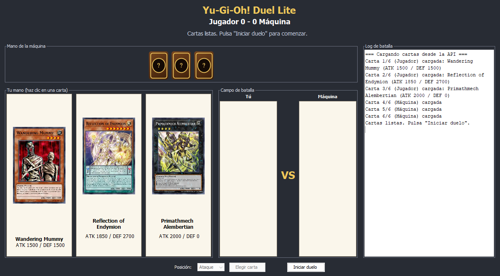
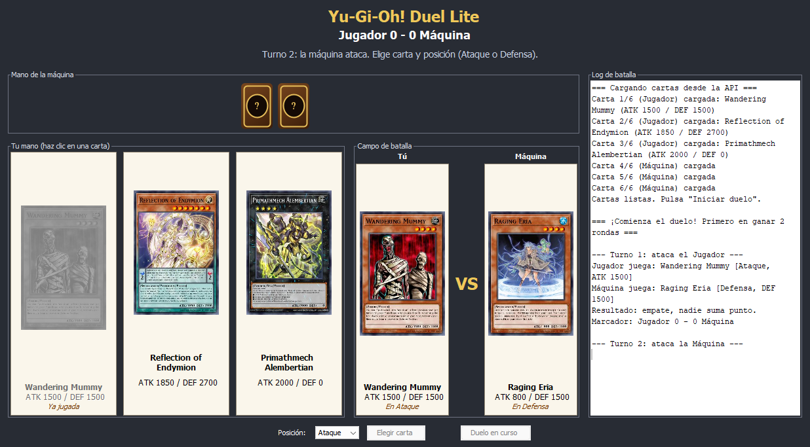
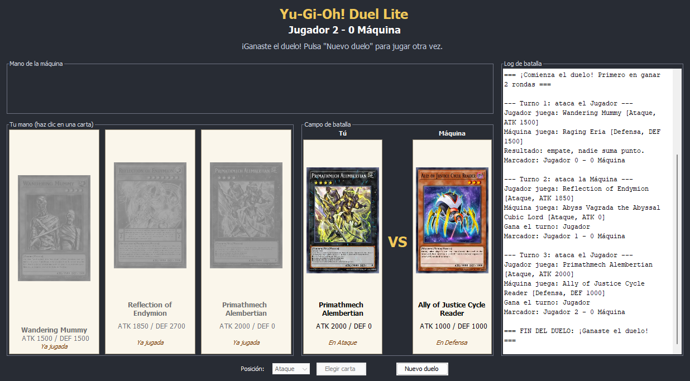

# Yu-Gi-Oh! Duel Lite

Laboratorio #1 de Desarrollo de Software III (Universidad del Valle, sede Tuluá).

Aplicación de escritorio en Java Swing que simula un duelo sencillo de Yu-Gi-Oh! entre el
jugador y la máquina. Las cartas se obtienen en vivo desde la API
[YGOProDeck](https://db.ygoprodeck.com/api-guide/).

## Requisitos

- Java 11 o superior (probado con OpenJDK 27).
- Conexión a internet.
- `org.json` (incluida en `lib/json-20260814.jar`, sin dependencias adicionales).

## Ejecución

### IntelliJ IDEA

1. Abrir la carpeta del proyecto (`Yu-Gi-Oh`). El módulo `Yu-Gi-Oh.iml` ya incluye `lib/json-20260814.jar`.
2. Ejecutar la clase `yugioh.Main`.

### Línea de comandos

Desde la carpeta del proyecto:

```bash
# Windows (separador ;)
javac -encoding UTF-8 -cp lib/json-20260814.jar -d out/production/Yu-Gi-Oh src/yugioh/*.java src/yugioh/*/*.java
java -cp "out/production/Yu-Gi-Oh;lib/json-20260814.jar" yugioh.Main

# Linux / macOS (separador :)
java -cp "out/production/Yu-Gi-Oh:lib/json-20260814.jar" yugioh.Main
```

## Cómo se juega

1. Al abrir la aplicación se descargan 3 cartas Monster para cada jugador. El botón
   **Iniciar duelo** se habilita solo cuando las 6 cartas están cargadas.
2. Se sortea quién ataca primero y después el ataque se alterna en cada turno.
3. Haz clic en una de tus cartas y pulsa **Elegir carta**. La máquina juega una carta al azar.
   - Si te toca atacar, tu carta va en **Ataque** y la máquina elige al azar Ataque o Defensa.
   - Si ataca la máquina, eliges tu posición en el desplegable **Posición**.
4. Reglas de comparación:
   - Ataque vs Ataque: gana el mayor ATK.
   - Ataque vs Defensa: ATK del atacante contra DEF del defensor.
   - Valores iguales: empate, nadie suma punto.
5. Gana el duelo quien llegue primero a 2 rondas. Si se acaban las cartas por empates, gana
   quien tenga más rondas (o el duelo queda empatado).
6. **Nuevo duelo** descarga 6 cartas nuevas.

## Diseño

El proyecto separa responsabilidades en cuatro paquetes. `yugioh.model` contiene los datos
(`Card` y la enumeración `Position`). `yugioh.api.YgoApiClient` consume `randomcard.php` con
`java.net.http.HttpClient`, sigue la redirección que hace la API, parsea el JSON con `org.json` y
vuelve a pedir la carta si no es Monster o si no tiene ATK/DEF numéricos (por ejemplo, monstruos
Link). Los fallos se traducen a `ApiException` con mensajes para el usuario ("Error de red...",
"No se pudo cargar la carta..."). `yugioh.logic.Duel` implementa las reglas sin depender de Swing
y comunica lo que pasa a través de la interfaz `BattleListener` (`onTurn`, `onScoreChanged`,
`onDuelEnded`, además de `onTurnStarted` y `onCardsRevealed`).

`yugioh.ui.DuelFrame` es la ventana principal: implementa `BattleListener` para actualizar el
marcador, el campo de batalla y el log (`JTextArea` + `JScrollPane`), y usa `ActionListener` en los
botones **Iniciar duelo** y **Elegir carta**. Las peticiones a la API y la descarga de imágenes
se hacen en un `SwingWorker`, así el hilo de la interfaz (EDT) nunca se bloquea; el progreso se
publica en el log y, si hay un error, se muestra un diálogo y el botón cambia a
**Reintentar carga**. `CardPanel` es el componente reutilizable que dibuja cada carta (imagen,
nombre, ATK/DEF) o su reverso.

```
src/yugioh
├── Main.java                 punto de entrada
├── model/   Card, Position
├── api/     YgoApiClient, ApiException
├── logic/   Duel, BattleListener
└── ui/      DuelFrame, CardPanel
```

## Capturas de pantalla

Cartas cargadas, listas para el duelo:



Turno jugado (campo de batalla y log):



Fin del duelo:


