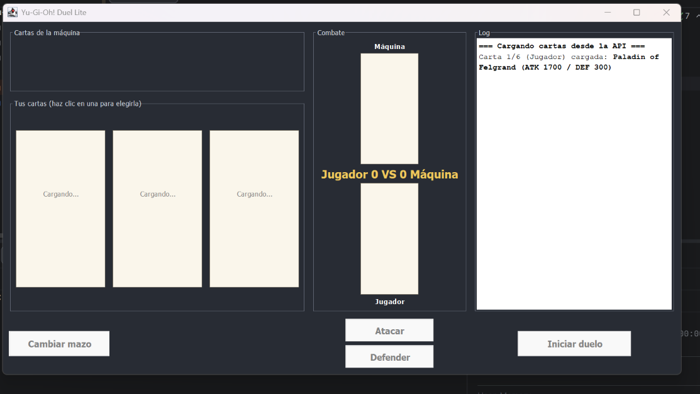
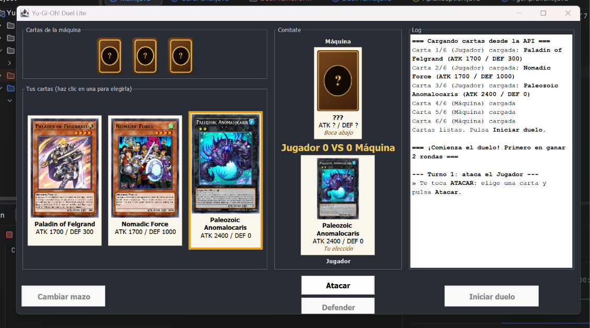
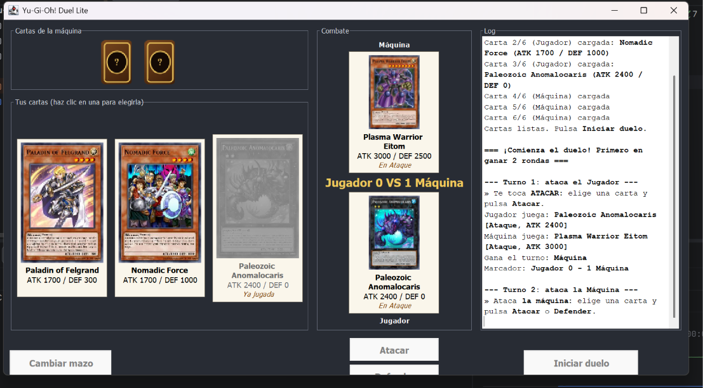
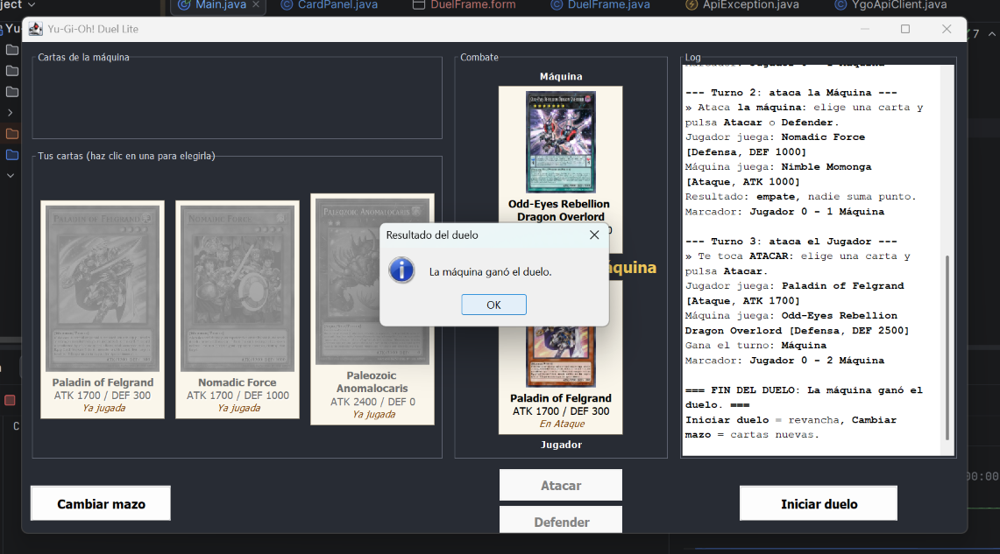

# Yu-Gi-Oh! Duel Lite

**Laboratorio #1 de Desarrollo de Software III** 

Aplicación de escritorio en Java Swing que simula un duelo sencillo de Yu-Gi-Oh! entre el
jugador y la máquina. Las cartas se obtienen en vivo desde la API
[YGOProDeck](https://db.ygoprodeck.com/api-guide/).

## ¿Cómo funciona?

Al abrir la aplicación se descargan 6 cartas de monstruo al azar: 3 para el jugador y 3 para la máquina. Las del jugador se ven boca arriba con su imagen, nombre, ATK y DEF; las de la máquina se quedan boca abajo. Cuando las 6 están listas se activa el botón **Iniciar duelo**.

Al presionar **Iniciar duelo** se sortea quién ataca primero y desde ahí el ataque se va turnando. En cada turno:

1. Se hace clic en una de las cartas propias. Esa carta pasa a la zona de **Combate** boca arriba y la de la máquina aparece boca abajo.
2. Se presiona **Atacar** o **Defender**. Si le toca atacar al jugador solo está disponible **Atacar**; si ataca la máquina se puede escoger cualquiera de los dos.
3. La carta de la máquina se voltea, se comparan las dos y en el log se va mostrando, un mensaje por segundo, qué carta jugó cada uno, quién ganó el turno y cómo va el marcador. Los datos importantes salen en **negrilla**.

Cada carta se usa una sola vez. Gana el duelo el primero que gane 2 turnos, y al final sale un mensaje con el ganador.

Cuando termina el duelo, **Iniciar duelo** juega la revancha con las mismas cartas y **Cambiar mazo** descarga 6 cartas nuevas. Si no se pudieron cargar las cartas (por ejemplo, sin internet), sale un mensaje de error y con **Cambiar mazo** se vuelve a intentar.

## Cómo ejecutarlo

Se necesita internet, porque las cartas y sus imágenes se descargan de YGOProDeck.

1. Abrir la carpeta del proyecto en IntelliJ (`File → Open`).
2. Revisar que tenga un JDK 17 o más nuevo en `File → Project Structure → Project` (se probó con OpenJDK 27).
3. Revisar que esté la librería JSON en `File → Project Structure → Modules → Dependencies`. Debe aparecer `json-20260814.jar`. Si no está, se agrega con `+ → JARs or Directories` escogiendo el archivo `lib/json-20260814.jar`.
4. En `File → Settings → Editor → GUI Designer`, dejar la opción `Generate GUI into` en `Binary class files`. Esto es necesario para que IntelliJ arme la ventana a partir del archivo `.form`.
5. Abrir `src/yugioh/Main.java` y darle al botón verde ▶ al lado de `main`.

Si al abrir sale un error `NullPointerException`, casi siempre es porque no se generó la ventana del `.form`. Se arregla revisando el paso 4 y usando `Build → Rebuild Project`.

## Cómo está organizado

```
src/yugioh/
├── Main.java                  Abre la ventana
├── model/
│   ├── Card.java              Los datos de una carta (nombre, tipo, ATK, DEF, imagen)
│   └── Position.java          Ataque o Defensa
├── api/
│   ├── YgoApiClient.java      Pide las cartas a YGOProDeck y lee el JSON
│   └── ApiException.java      Error cuando falla la conexión o la respuesta
├── logic/
│   ├── Duel.java              Las reglas del duelo
│   └── BattleListener.java    Los avisos que da el duelo
└── ui/
    ├── DuelFrame.form         El diseño de la ventana
    ├── DuelFrame.java         Lo que hace la ventana
    └── CardPanel.java         El componente que dibuja cada carta (o su reverso)
```

## Diseño

Separé el proyecto en cuatro paquetes para que cada parte se encargara de una sola cosa:

**`model`** guarda los datos de las cartas

**`api`** se conecta con la API de YGOProDeck

**`logic`** tiene las reglas del duelo

**`ui`** es la ventana, esta es la única parte que usa Swing. Ninguna de las tres anteriores sabe nada de la ventana. Así la lógica del duelo se puede cambiar o probar sin tocar la interfaz, y la ventana solo se encarga de mostrar lo que pasa.

Para que el duelo pudiera avisar lo que pasa sin depender de la ventana, hice la interfaz `BattleListener` (esto se conoce como patrón Observer). `Duel` va avisando cuando empieza un turno (`onTurnStarted`), cuando se voltean las cartas (`onCardsRevealed`), el resultado de cada turno (`onTurn`), cuando cambia el marcador (`onScoreChanged`) y cuando termina el duelo (`onDuelEnded`). La ventana recibe esos avisos y los muestra.

La tarea lenta, que es descargar las 6 cartas y sus imágenes, se hace en otro hilo con `SwingWorker`, para que la ventana no se congele mientras carga. El progreso se va publicando en el log. El duelo en cambio es rápido y lo ejecutan los botones, que ya están en el hilo de la ventana, así que los avisos del duelo pueden actualizarla directamente. Para la pausa de 1 segundo entre mensajes del log usé un `javax.swing.Timer` en lugar de `Thread.sleep`, porque dormir el hilo de la ventana la congelaría. Mientras el log está escribiendo, los botones esperan, para que no se pueda jugar el siguiente turno sin haber leído el resultado.

## Reglas del combate

En cada turno uno ataca y el otro defiende. El primer atacante se sortea y después se van turnando.

- El que ataca siempre juega su carta en **Ataque**.
- El que defiende escoge **Ataque** o **Defensa**. La máquina lo escoge al azar.
- La máquina juega una de sus cartas al azar.

Las cartas se comparan así:

```
Ataque  vs Ataque   →  ATK del atacante  contra  ATK del defensor
Ataque  vs Defensa  →  ATK del atacante  contra  DEF del defensor
```

- Gana el turno el valor más alto y suma 1 punto. Si los valores son iguales es **empate** y nadie suma.
- Defender no garantiza perder: si la DEF del defensor es más alta que el ATK del atacante, el turno lo gana el defensor. Por ejemplo, si ataco con ATK 1800 y la máquina defiende con DEF 2000, gana la máquina.
- Gana el duelo el primero que llegue a **2 puntos**. Si se acaban las 3 cartas antes (porque hubo empates), gana el que tenga más puntos, y si están iguales el duelo queda empatado.

Algunos casos que tuve en cuenta:

- **Cartas que no sirven:** la API puede devolver cartas mágicas, trampas o monstruos Link, que no tienen DEF. En esos casos se vuelve a pedir otra carta.
- **Cartas repetidas:** si la API devuelve una carta que ya salió, se pide otra, para que las 6 sean distintas. Hay un límite de intentos para que no se quede pidiendo cartas para siempre.
- **Imagen que no carga:** si falla solo la imagen, la carta igual se puede jugar y se muestra "Imagen no disponible".
- **Sin internet o error de la API:** sale un mensaje como "Error de red..." o "No se pudo cargar la carta..." y con **Cambiar mazo** se vuelve a intentar.

## Capturas de pantalla

### Ventana al iniciar


### Cartas cargadas


### Turno de los jugadores


### Fin del duelo

